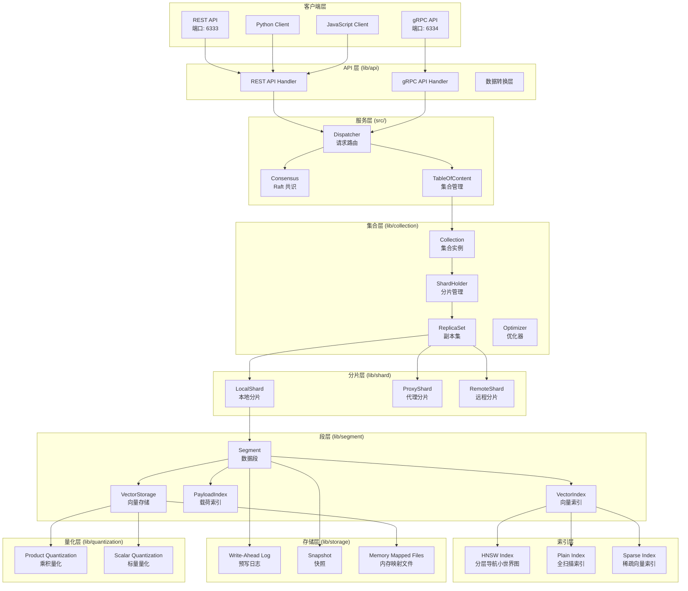
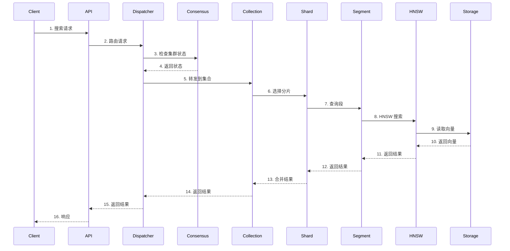
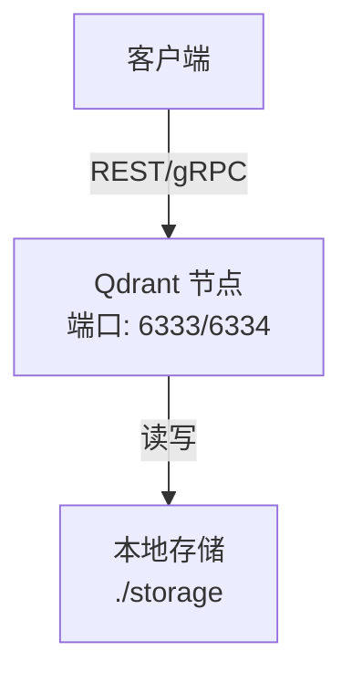
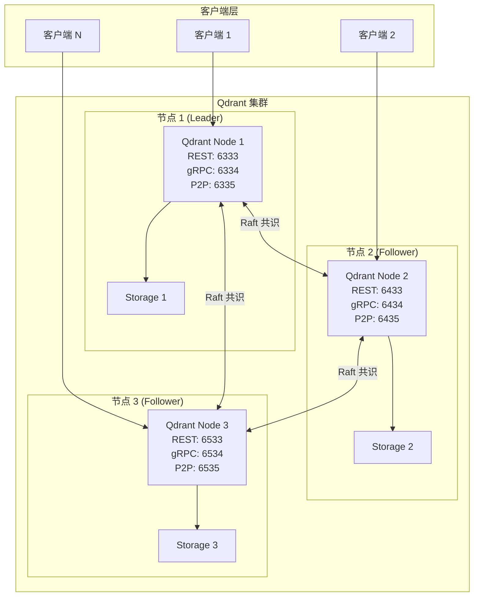
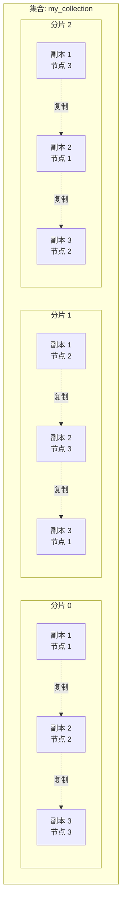

# Qdrant 向量数据库系统架构分析文档

## 目录

1. [系统概述](#系统概述)
2. [系统架构图](#系统架构图)
3. [核心模块说明](#核心模块说明)
4. [核心算法详解](#核心算法详解)
5. [部署架构](#部署架构)
6. [使用入门手册](#使用入门手册)

---

## 系统概述

Qdrant 是一个高性能的向量相似度搜索引擎和向量数据库，使用 Rust 语言开发。它提供了生产就绪的服务，具有便捷的 API 来存储、搜索和管理向量数据点（带附加载荷的向量）。

### 主要特性

- **高性能向量搜索**：基于 HNSW 算法的近似最近邻搜索
- **分布式部署**：支持分片（Sharding）和副本（Replication）
- **向量量化**：支持 PQ（Product Quantization）等量化技术，可减少高达 97% 的内存使用
- **混合搜索**：支持稠密向量和稀疏向量的混合搜索
- **强大的过滤**：支持基于载荷（Payload）的复杂过滤条件
- **持久化存储**：支持内存映射（mmap）和磁盘存储
- **Raft 共识**：分布式模式下使用 Raft 协议保证一致性

---

## 系统架构图

### 整体架构



### 数据流架构



---

## 核心模块说明

### 1. 主程序入口 (src/)

#### src/main.rs
- **功能**：Qdrant 服务的主入口点
- **职责**：
  - 解析命令行参数和配置文件
  - 初始化日志系统
  - 创建运行时（Runtime）环境
  - 初始化共识系统（如果启用集群模式）
  - 启动 REST 和 gRPC 服务器
  - 管理服务生命周期

**关键代码片段**：
```rust
// 创建运行时
let search_runtime = create_search_runtime(settings.storage.performance.max_search_threads)?;
let update_runtime = create_update_runtime(settings.storage.performance.max_optimization_runtime_threads)?;

// 初始化共识
if is_distributed_deployment {
    let consensus_state = ConsensusManager::new(...)?;
    let handle = Consensus::run(...)?;
}

// 启动服务器
actix::init(dispatcher_arc, telemetry_collector, health_checker, settings, logger_handle)?;
tonic::init(dispatcher_arc, tonic_telemetry_collector, settings, grpc_port, runtime_handle)?;
```

#### src/consensus.rs
- **功能**：实现 Raft 共识算法
- **职责**：
  - 管理 Raft 节点状态
  - 处理来自客户端的操作提案
  - 处理来自其他节点的 Raft 消息
  - 维护集群成员关系
  - 处理领导者选举

#### src/settings.rs
- **功能**：配置管理
- **职责**：
  - 加载和验证配置文件
  - 提供默认配置值
  - 支持环境变量覆盖

### 2. API 层 (lib/api/)

#### lib/api/src/rest/
- **功能**：REST API 处理
- **职责**：
  - 处理 HTTP 请求
  - 参数验证
  - 响应格式化
  - 错误处理

#### lib/api/src/grpc/
- **功能**：gRPC API 处理
- **职责**：
  - 处理 gRPC 请求
  - Protocol Buffers 序列化/反序列化
  - 流式传输支持

#### lib/api/src/conversions/
- **功能**：数据格式转换
- **职责**：
  - REST 和 gRPC 之间的数据转换
  - 内部数据结构和 API 数据结构之间的转换

### 3. 存储管理层 (lib/storage/)

#### lib/storage/src/content_manager/
- **功能**：内容管理
- **职责**：
  - 管理集合的创建、删除、更新
  - 管理快照操作
  - 管理集群状态

**关键组件**：
- `TableOfContent`：集合的目录表，管理所有集合
- `Dispatcher`：请求分发器，决定请求是直接处理还是通过共识
- `ConsensusManager`：共识管理器，管理 Raft 状态

### 4. 集合层 (lib/collection/)

#### lib/collection/src/collection/
- **功能**：集合管理
- **职责**：
  - 管理集合的配置
  - 协调分片操作
  - 处理集合级别的查询

**关键结构**：
```rust
pub struct Collection {
    shard_holder: Arc<LockedShardHolder>,  // 分片持有者
    collection_config: Arc<RwLock<CollectionConfigInternal>>,  // 集合配置
    payload_index_schema: Arc<SaveOnDisk<PayloadIndexSchema>>,  // 载荷索引模式
    // ...
}
```

#### lib/collection/src/shards/
- **功能**：分片和副本管理
- **职责**：
  - 管理分片的分布
  - 管理副本集
  - 处理分片间的数据同步
  - 处理分片转移

**关键组件**：
- `ShardHolder`：管理所有分片
- `ShardReplicaSet`：管理一个分片的所有副本
- `LocalShard`：本地分片
- `ProxyShard`：代理分片（指向远程分片）
- `RemoteShard`：远程分片客户端

#### lib/collection/src/collection_manager/optimizers/
- **功能**：段优化器
- **职责**：
  - 合并小段
  - 删除已删除的向量
  - 重建索引
  - 压缩数据

### 5. 段层 (lib/segment/)

#### lib/segment/src/
- **功能**：数据段管理
- **职责**：
  - 存储向量数据
  - 管理载荷（Payload）
  - 维护向量索引
  - 维护载荷索引

**关键组件**：
- `Segment`：数据段，是数据存储的基本单位
- `VectorStorage`：向量存储，管理向量的物理存储
- `PayloadStorage`：载荷存储，管理附加数据
- `IdTracker`：ID 跟踪器，管理点 ID 到内部偏移量的映射

#### lib/segment/src/index/
- **功能**：索引管理
- **职责**：
  - 向量索引（HNSW、Plain）
  - 载荷索引（字段索引、全文索引等）
  - 查询优化

**关键组件**：
- `HNSWIndex`：HNSW 索引实现
- `StructPayloadIndex`：结构化载荷索引
- `FieldIndex`：字段索引（支持多种类型：整数、浮点数、字符串、地理位置等）

#### lib/segment/src/vector_storage/
- **功能**：向量存储
- **职责**：
  - 向量的物理存储
  - 支持内存和磁盘存储
  - 支持量化存储

**关键组件**：
- `SimpleVectorStorage`：简单向量存储（内存）
- `MemmapVectorStorage`：内存映射向量存储（磁盘）
- `QuantizedVectors`：量化向量存储

### 6. 量化层 (lib/quantization/)

#### lib/quantization/src/
- **功能**：向量量化
- **职责**：
  - 实现乘积量化（PQ）
  - 实现标量量化（Scalar Quantization）
  - 量化向量的编码和解码
  - 量化向量的相似度计算

**关键组件**：
- `EncodedVectorsPQ`：乘积量化实现
- `EncodedVectorsU8`：U8 标量量化
- `EncodedVectorsF16`：F16 标量量化

### 7. 稀疏向量层 (lib/sparse/)

#### lib/sparse/src/
- **功能**：稀疏向量支持
- **职责**：
  - 稀疏向量的存储
  - 稀疏向量的索引
  - 稀疏向量的搜索

### 8. 通用工具层 (lib/common/)

#### lib/common/common/
- **功能**：通用工具和数据结构
- **职责**：
  - 硬件计数器（用于性能监控）
  - CPU 预算管理
  - IO 预算管理
  - 各种工具函数

#### lib/common/memory/
- **功能**：内存管理
- **职责**：
  - 内存映射操作
  - 文件系统检查
  - 内存建议（madvise）

#### lib/common/cancel/
- **功能**：取消操作支持
- **职责**：
  - 提供取消令牌
  - 支持操作取消

### 9. GPU 支持 (lib/gpu/)

#### lib/gpu/src/
- **功能**：GPU 加速
- **职责**：
  - GPU 设备管理
  - GPU 上的 HNSW 构建
  - GPU 上的向量计算

### 10. 网格存储 (lib/gridstore/)

#### lib/gridstore/src/
- **功能**：网格存储系统
- **职责**：
  - 提供键值存储抽象
  - 支持多种存储后端

---

## 核心算法详解

### 1. HNSW (Hierarchical Navigable Small World) 算法

HNSW 是 Qdrant 用于向量相似度搜索的核心算法，它构建了一个分层的图结构来加速最近邻搜索。

#### 算法原理

HNSW 构建了一个多层图结构：
- **第 0 层**：包含所有向量，连接密度高
- **上层**：包含部分向量，连接密度递减
- **顶层**：包含少量向量，用于快速定位

#### 代码实现分析

**位置**：`lib/segment/src/index/hnsw_index/hnsw.rs`

**关键结构**：
```rust
pub struct HNSWIndex {
    id_tracker: Arc<AtomicRefCell<IdTrackerSS>>,
    vector_storage: Arc<AtomicRefCell<VectorStorageEnum>>,
    quantized_vectors: Arc<AtomicRefCell<Option<QuantizedVectors>>>,
    payload_index: Arc<AtomicRefCell<StructPayloadIndex>>,
    config: HnswGraphConfig,
    path: PathBuf,
    graph: GraphLayers,  // 图层次结构
    searches_telemetry: HNSWSearchesTelemetry,
    is_on_disk: bool,
}
```

**搜索过程**（参考 `lib/segment/src/index/hnsw_index/hnsw.rs:1358-1450`）：

```rust
fn search(
    &self,
    vectors: &[&QueryVector],
    filter: Option<&Filter>,
    top: usize,
    params: Option<&SearchParams>,
    query_context: &VectorQueryContext,
) -> OperationResult<Vec<Vec<ScoredPointOffset>>> {
    // 1. 检查是否需要使用 HNSW
    let is_hnsw_disabled = self.config.m == 0 && self.config.payload_m.unwrap_or(0) == 0;
    
    // 2. 根据过滤条件选择搜索策略
    match filter {
        None => {
            // 无过滤条件：直接使用 HNSW 搜索
            self.graph.search(
                vectors,
                top,
                params,
                &mut scorer,
                query_context,
            )
        }
        Some(filter) => {
            // 有过滤条件：使用过滤搜索
            // 首先估计满足过滤条件的点数
            let estimation = self.payload_index.borrow().estimate_cardinality(filter, ...)?;
            
            // 根据估计值选择策略
            if estimation.primary_clauses.len() == 1 && estimation.exp < self.config.full_scan_threshold {
                // 小基数：使用全扫描
                self.plain_search_with_filter(vectors, filter, top, params, query_context)
            } else {
                // 大基数：使用 HNSW + 过滤
                self.graph.search_with_filter(
                    vectors,
                    filter,
                    top,
                    params,
                    &mut scorer,
                    query_context,
                )
            }
        }
    }
}
```

**图构建过程**（参考 `lib/segment/src/index/hnsw_index/graph_layers_builder.rs`）：

1. **插入新向量**：
   - 随机选择层数（指数分布）
   - 从顶层开始搜索入口点
   - 逐层向下，在每一层找到最近的邻居
   - 建立连接，保持每个节点的连接数不超过 `m`

2. **连接优化**：
   - 使用启发式方法选择最佳连接
   - 保持图的导航性

**关键参数**：
- `m`：每个节点的最大连接数（影响索引大小和搜索精度）
- `ef_construct`：构建时的候选集大小（影响构建时间和索引质量）
- `ef`：搜索时的候选集大小（影响搜索精度和速度）

### 2. 乘积量化 (Product Quantization, PQ)

PQ 是一种向量量化技术，将高维向量压缩为低维表示，大幅减少内存使用。

#### 算法原理

1. **向量分割**：将原始向量分成多个子向量
2. **K-means 聚类**：对每个子向量空间进行 K-means 聚类，得到码本（codebook）
3. **编码**：将每个子向量替换为最近聚类中心的索引
4. **存储**：只存储索引（通常为 1 字节），而不是原始浮点数

#### 代码实现分析

**位置**：`lib/quantization/src/encoded_vectors_pq.rs`

**编码过程**（参考 `lib/quantization/src/encoded_vectors_pq.rs:66-140`）：

```rust
pub fn encode<'a>(
    data: impl Iterator<Item = impl AsRef<[f32]> + 'a> + Clone + Send,
    mut storage_builder: impl EncodedStorageBuilder<Storage = TStorage> + Send,
    vector_parameters: &VectorParameters,
    count: usize,
    chunk_size: usize,  // 每个子向量的大小
    max_kmeans_threads: usize,
    meta_path: Option<&Path>,
    stopped: &AtomicBool,
) -> Result<Self, EncodingError> {
    // 1. 将向量分割成块
    let vector_division = Self::get_vector_division(vector_parameters.dim, chunk_size);
    
    // 2. 为每个块找到聚类中心（码本）
    let centroids = Self::find_centroids(
        data.clone(),
        &vector_division,
        vector_parameters,
        count,
        CENTROIDS_COUNT,  // 256 个聚类中心
        max_kmeans_threads,
        stopped,
    )?;
    
    // 3. 编码数据：将每个子向量替换为最近中心的索引
    Self::encode_storage(
        data,
        &mut storage_builder,
        &vector_division,
        &centroids,
        max_kmeans_threads,
        stopped,
    )?;
    
    // 4. 保存元数据（码本和分割信息）
    // ...
}
```

**查找最近中心**（参考 `lib/quantization/src/encoded_vectors_pq.rs:301-325`）：

```rust
fn encode_vector(
    vector_data: &[f32],
    vector_division: &[Range<usize>],
    centroids: &[Vec<f32>],
    encoded_vector: &mut Vec<u8>,
) {
    encoded_vector.clear();
    for range in vector_division {
        let subvector_data = &vector_data[range.clone()];
        let mut min_distance = f32::MAX;
        let mut min_centroid_index = 0;
        
        // 对每个子向量，找到最近的聚类中心
        for (centroid_index, centroid) in centroids.iter().enumerate() {
            let centroid_data = &centroid[range.clone()];
            // 使用欧几里得距离
            let distance = subvector_data
                .iter()
                .zip(centroid_data)
                .map(|(a, b)| (a - b).powi(2))
                .sum();
            if distance < min_distance {
                min_distance = distance;
                min_centroid_index = centroid_index;
            }
        }
        // 存储中心索引（1 字节）
        encoded_vector.push(min_centroid_index as u8);
    }
}
```

**相似度计算**：

使用查找表（Lookup Table）加速：
- 预先计算查询向量的每个子向量到所有聚类中心的距离
- 搜索时只需查表，无需重新计算

**压缩比**：
- 原始向量：`dim * 4` 字节（f32）
- 量化后：`num_chunks * 1` 字节（u8）
- 典型压缩比：16-64 倍（取决于向量维度和块大小）

### 3. 分片和副本机制

Qdrant 支持水平扩展，通过分片（Sharding）和副本（Replication）实现。

#### 分片机制

**位置**：`lib/collection/src/shards/`

**分片类型**：
1. **自动分片（Auto Sharding）**：根据点 ID 的哈希值自动分配到分片
2. **自定义分片（Custom Sharding）**：根据分片键（Shard Key）分配到指定分片

**代码实现**（参考 `lib/collection/src/collection/mod.rs:119-169`）：

```rust
pub async fn build(
    collection_config: CollectionConfig,
    shard_distribution: ShardDistribution,
    shard_key_mapping: Option<ShardKeyMapping>,
    // ...
) -> CollectionResult<Self> {
    let sharding_method = collection_config.params.sharding_method.unwrap_or_default();
    let mut shard_holder = ShardHolder::new(path, sharding_method)?;
    
    // 为每个分片创建副本集
    for (shard_id, mut peers) in shard_distribution.shards {
        let is_local = peers.remove(&this_peer_id);
        
        let replica_set = ShardReplicaSet::build(
            shard_id,
            shard_key.clone(),
            name.clone(),
            this_peer_id,
            is_local,
            peers,  // 其他副本所在的节点
            // ...
        ).await?;
        
        shard_holder.add_shard(shard_id, replica_set, shard_key).await?;
    }
    // ...
}
```

#### 副本机制

**副本状态**（参考 `lib/collection/src/shards/replica_set/replica_set_state.rs`）：

```rust
pub enum ReplicaState {
    Active,      // 活跃副本，参与读写
    Dead,        // 死亡副本，不参与任何操作
    Initializing, // 初始化中，正在同步数据
    Listener,     // 监听副本，只接收更新，不处理查询
    Partial,      // 部分同步，数据不完整
}
```

**读写一致性**：

- **写一致性因子（Write Consistency Factor）**：定义需要多少个副本确认写入才算成功
- **读扇出因子（Read Fan Out Factor）**：定义同时查询多少个副本来平滑延迟峰值

**代码实现**（参考 `lib/collection/src/shards/replica_set/mod.rs:81-118`）：

```rust
pub struct ShardReplicaSet {
    local: RwLock<Option<Shard>>,  // 本地分片
    remotes: RwLock<Vec<RemoteShard>>,  // 远程分片
    replica_state: Arc<SaveOnDisk<ReplicaSetState>>,
    // ...
}

// 写入操作：需要满足写一致性因子
pub async fn update(
    &self,
    operation: CollectionUpdateOperations,
    wait: bool,
) -> CollectionResult<UpdateResult> {
    // 1. 确定需要更新的副本
    let active_replicas = self.get_active_replicas().await?;
    let write_consistency_factor = self.write_consistency_factor();
    
    // 2. 并发更新所有活跃副本
    let update_futures: Vec<_> = active_replicas
        .iter()
        .map(|replica| replica.update(operation.clone(), wait))
        .collect();
    
    // 3. 等待足够的确认
    let results = futures::future::join_all(update_futures).await;
    // 检查是否满足写一致性因子
    // ...
}

// 读取操作：优先使用本地副本
pub async fn retrieve(
    &self,
    request: &RetrieveRequest,
    shard_selection: &ShardSelector,
) -> CollectionResult<Vec<Record>> {
    // 优先使用本地副本
    if let Some(local) = &*self.local.read() {
        return local.retrieve(request, shard_selection).await;
    }
    // 否则使用远程副本
    // ...
}
```

### 4. Raft 共识算法

Qdrant 在分布式模式下使用 Raft 算法保证集群一致性。

#### 实现位置

**位置**：`src/consensus.rs`

**关键组件**：

```rust
pub struct Consensus {
    node: Node,  // Raft 节点
    receiver: Receiver<Message>,  // 消息接收器
    runtime: Handle,  // 异步运行时
    config: ConsensusConfig,
    broker: RaftMessageBroker,  // Raft 消息代理
    raft_config: Config,
}
```

**共识操作**（参考 `lib/storage/src/content_manager/consensus_ops.rs`）：

```rust
pub enum ConsensusOperations {
    // 集合操作
    CreateCollection { collection_name: String, ... },
    DropCollection { collection_name: String },
    UpdateCollection { collection_name: String, ... },
    
    // 分片操作
    MoveShard { collection_name: String, shard_id: ShardId, to_peer_id: PeerId },
    ReplicateShard { collection_name: String, shard_id: ShardId, to_peer_id: PeerId },
    AbortShardTransfer { collection_name: String, shard_id: ShardId, to_peer_id: PeerId },
    
    // 集群操作
    AddPeer { peer_id: PeerId, uri: String, ... },
    RemovePeer { peer_id: PeerId },
    // ...
}
```

**共识流程**（参考 `src/consensus.rs:465-550`）：

```rust
pub fn start(&mut self) -> anyhow::Result<()> {
    // 1. 如果是单节点，立即选举为领导者
    if self.node.store().peer_count() == 1 {
        while !self.node.has_ready() {
            self.node.tick();
        }
    }
    
    let tick_period = Duration::from_millis(self.config.tick_period_ms);
    
    loop {
        // 2. 处理 Raft 消息
        let raft_messages = self.advance_node(tick_period)?;
        
        // 3. 计算需要报告的 tick 数
        let elapsed_ticks = previous_tick.elapsed().div_duration_f32(tick_period) as u32;
        
        // 4. 定期 tick Raft 节点
        for _ in 0..report_ticks {
            self.node.tick();
        }
        
        // 5. 处理就绪状态
        while self.node.has_ready() {
            let ready = self.node.ready();
            // 应用已提交的条目
            // 发送消息到其他节点
            // 推进状态
        }
        
        // 6. 处理客户端提案
        while let Ok(msg) = self.receiver.try_recv() {
            match msg {
                Message::FromClient(operation) => {
                    // 作为领导者，提出操作
                    if self.node.raft.state == StateRole::Leader {
                        self.node.propose(vec![], operation.into())?;
                    }
                }
                Message::FromPeer(raft_msg) => {
                    // 处理来自其他节点的 Raft 消息
                    self.node.step(*raft_msg)?;
                }
            }
        }
    }
}
```

### 5. 载荷索引和过滤

Qdrant 支持基于载荷（Payload）的复杂过滤，并优化查询执行。

#### 载荷索引类型

**位置**：`lib/segment/src/index/field_index/`

**支持的索引类型**：
1. **整数索引**：范围查询、精确匹配
2. **浮点数索引**：范围查询
3. **字符串索引**：精确匹配、前缀匹配
4. **全文索引**：文本搜索（基于倒排索引）
5. **地理位置索引**：地理范围查询
6. **布尔索引**：布尔值查询

#### 查询优化

**位置**：`lib/segment/src/index/struct_payload_index.rs`

**优化策略**（参考 `lib/segment/src/index/struct_payload_index.rs:99-121`）：

```rust
pub fn estimate_field_condition(
    &self,
    condition: &FieldCondition,
    nested_path: Option<&JsonPath>,
    hw_counter: &HardwareCounterCell,
) -> Option<CardinalityEstimation> {
    let full_path = JsonPath::extend_or_new(nested_path, &condition.key);
    
    // 查找字段索引
    self.field_indexes.get(&full_path).and_then(|indexes| {
        let full_path_condition = FieldCondition {
            key: full_path,
            ..condition.clone()
        };
        
        // 使用索引估计基数
        indexes
            .iter()
            .find_map(|index| index.estimate_cardinality(&full_path_condition, hw_counter))
    })
}
```

**查询计划**：

1. **估计基数**：使用索引估计满足过滤条件的点数
2. **选择策略**：
   - 小基数（< full_scan_threshold）：使用全扫描 + 过滤
   - 大基数：使用 HNSW 搜索 + 后过滤
3. **索引使用**：优先使用选择性高的索引

### 6. 段优化

段优化器负责合并小段、删除已删除的向量、重建索引等。

#### 优化策略

**位置**：`lib/collection/src/collection_manager/optimizers/`

**优化条件**（参考 `config/config.yaml:97-120`）：

```yaml
optimizers:
  # 删除向量比例阈值
  deleted_threshold: 0.2
  
  # 段大小阈值
  vacuum_min_vector_number: 1000
  
  # 索引重建阈值
  default_segment_number: 0
```

**优化过程**：

1. **段合并**：合并小段以减少段数量
2. **向量删除**：物理删除标记为删除的向量
3. **索引重建**：重建 HNSW 索引以优化性能
4. **量化重建**：重新量化向量以优化压缩

---

## 部署架构

### 单节点部署



**特点**：
- 简单易用
- 适合开发和测试
- 单点故障风险

### 集群部署



**特点**：
- 高可用性
- 水平扩展
- 数据冗余
- 需要至少 3 个节点（推荐奇数个）

### 分片和副本架构



**说明**：
- 每个分片有多个副本（通常 3 个）
- 副本分布在不同的节点上
- 写入需要满足写一致性因子
- 读取优先使用本地副本

---

## 使用入门手册

### 1. 安装

#### Docker 安装（推荐）

```bash
# 拉取镜像
docker pull qdrant/qdrant

# 运行容器（单节点）
docker run -p 6333:6333 -p 6334:6334 \
    -v $(pwd)/qdrant_storage:/qdrant/storage \
    qdrant/qdrant
```

#### 从源码编译

```bash
# 克隆仓库
git clone https://github.com/qdrant/qdrant.git
cd qdrant

# 编译
cargo build --release

# 运行
./target/release/qdrant
```

### 2. 配置

#### 基本配置

编辑 `config/config.yaml`：

```yaml
# 服务配置
service:
  http_port: 6333
  grpc_port: 6334

# 存储配置
storage:
  storage_path: ./storage
  snapshots_path: ./snapshots

# 集群配置（可选）
cluster:
  enabled: false  # 设置为 true 启用集群模式
  peer_id: 1
```

#### 集群配置

**节点 1（第一个节点）**：

```yaml
cluster:
  enabled: true
  peer_id: 1
  p2p:
    port: 6335
```

启动命令：
```bash
./qdrant --uri 'http://node1:6335'
```

**节点 2（加入集群）**：

```yaml
cluster:
  enabled: true
  peer_id: 2
  p2p:
    port: 6435
```

启动命令：
```bash
./qdrant --bootstrap 'http://node1:6335' --uri 'http://node2:6435'
```

**节点 3（加入集群）**：

```yaml
cluster:
  enabled: true
  peer_id: 3
  p2p:
    port: 6535
```

启动命令：
```bash
./qdrant --bootstrap 'http://node1:6335' --uri 'http://node3:6535'
```

### 3. 基本操作

#### 使用 Python 客户端

```python
from qdrant_client import QdrantClient
from qdrant_client.models import Distance, VectorParams, PointStruct

# 连接 Qdrant
client = QdrantClient("http://localhost:6333")

# 创建集合
client.create_collection(
    collection_name="my_collection",
    vectors_config=VectorParams(size=128, distance=Distance.COSINE),
)

# 插入向量
points = [
    PointStruct(
        id=1,
        vector=[0.1] * 128,
        payload={"name": "point1", "category": "A"}
    ),
    PointStruct(
        id=2,
        vector=[0.2] * 128,
        payload={"name": "point2", "category": "B"}
    ),
]

client.upsert(collection_name="my_collection", points=points)

# 搜索
results = client.search(
    collection_name="my_collection",
    query_vector=[0.15] * 128,
    limit=10,
)

# 带过滤的搜索
from qdrant_client.models import Filter, FieldCondition, MatchValue

results = client.search(
    collection_name="my_collection",
    query_vector=[0.15] * 128,
    query_filter=Filter(
        must=[
            FieldCondition(
                key="category",
                match=MatchValue(value="A")
            )
        ]
    ),
    limit=10,
)
```

#### 使用 REST API

```bash
# 创建集合
curl -X PUT http://localhost:6333/collections/my_collection \
  -H 'Content-Type: application/json' \
  -d '{
    "vectors": {
      "size": 128,
      "distance": "Cosine"
    }
  }'

# 插入向量
curl -X PUT http://localhost:6333/collections/my_collection/points \
  -H 'Content-Type: application/json' \
  -d '{
    "points": [
      {
        "id": 1,
        "vector": [0.1, 0.2, ...],
        "payload": {"name": "point1"}
      }
    ]
  }'

# 搜索
curl -X POST http://localhost:6333/collections/my_collection/points/search \
  -H 'Content-Type: application/json' \
  -d '{
    "vector": [0.15, 0.25, ...],
    "limit": 10
  }'
```

### 4. 高级配置

#### HNSW 索引配置

```python
from qdrant_client.models import HnswConfigDiff

client.update_collection(
    collection_name="my_collection",
    hnsw_config=HnswConfigDiff(
        m=16,  # 每个节点的最大连接数
        ef_construct=200,  # 构建时的候选集大小
    )
)
```

#### 量化配置

```python
from qdrant_client.models import QuantizationConfig, ScalarQuantization

client.update_collection(
    collection_name="my_collection",
    quantization_config=QuantizationConfig(
        scalar=ScalarQuantization(
            type="int8",  # 或 "int16"
            quantile=0.99,
            always_ram=True,
        )
    )
)
```

#### 分片和副本配置

```python
from qdrant_client.models import CreateCollection, VectorParams, Distance

client.create_collection(
    collection_name="my_collection",
    vectors_config=VectorParams(size=128, distance=Distance.COSINE),
    shard_number=3,  # 3 个分片
    replication_factor=3,  # 每个分片 3 个副本
    write_consistency_factor=2,  # 写入需要 2 个副本确认
)
```

### 5. 监控和维护

#### 健康检查

```bash
curl http://localhost:6333/health
```

#### 集合信息

```bash
curl http://localhost:6333/collections/my_collection
```

#### 集群状态

```bash
curl http://localhost:6333/cluster
```

#### 快照

```bash
# 创建快照
curl -X POST http://localhost:6333/collections/my_collection/snapshots

# 恢复快照
curl -X PUT http://localhost:6333/collections/my_collection/snapshots/recover \
  -H 'Content-Type: application/json' \
  -d '{
    "location": "snapshots/my_collection-123456.snapshot"
  }'
```

### 6. 性能优化建议

1. **索引配置**：
   - 根据数据规模调整 `m` 和 `ef_construct`
   - 大集合使用更大的 `m` 值

2. **量化**：
   - 使用标量量化减少内存使用
   - 权衡精度和内存

3. **分片**：
   - 根据数据量设置合适的分片数
   - 每个分片建议 1-10M 向量

4. **副本**：
   - 生产环境建议 3 个副本
   - 根据读负载调整副本数

5. **硬件**：
   - 使用 SSD 存储
   - 充足的内存（建议向量数据大小的 2-3 倍）
   - 多核 CPU 用于并行搜索

---

## 总结

Qdrant 是一个功能强大、性能优异的向量数据库系统。其核心优势包括：

1. **高性能**：基于 HNSW 算法的快速向量搜索
2. **可扩展**：支持分片和副本的水平扩展
3. **内存高效**：通过量化技术大幅减少内存使用
4. **功能丰富**：支持复杂过滤、混合搜索等高级功能
5. **生产就绪**：完善的持久化、快照、集群管理等特性

通过本文档，您应该对 Qdrant 的系统架构、核心算法和使用方法有了全面的了解。如需更详细的信息，请参考官方文档：https://qdrant.tech/documentation/
